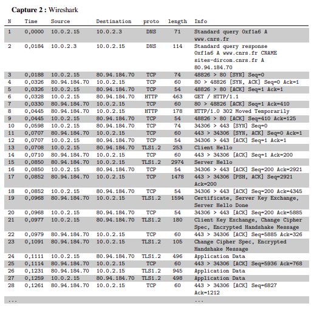
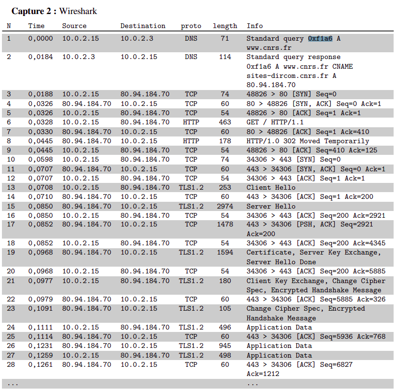

<script
  src="https://cdn.mathjax.org/mathjax/latest/MathJax.js?config=TeX-AMS-MML_HTMLorMML"
  type="text/javascript">
</script>
# EXPLICATIONS DES CORRECTIONS DE RESEAU
## Base de réseau 2023

[Sujet](./CS/reseau/sujet_reseau_2023.pdf) et [Correction](./CS/reseau/correction_reseau_2023.pdf)



https://fr.wikipedia.org/wiki/Transport_Layer_Security

### Q10 :


https://fr.wikipedia.org/wiki/Transport_Layer_Security  TLS


### Q11 : 

Le dns est le seul proto utilisant les noms de domaines, les autres utilisent des adresses ip. on va donc chercher le premier appel avec un protocol DNS et dans les infos, on trouver le nom de domaine.

Une fois qu'on a récupérer le nom de domaine, on peut chercher l'appel à d'autres protocoles... Et on trouve HTTP : on en déduit que le site est en HTTP. Donc, le lien de redirection est : http://www.cnrs.fr et non www.cnrs.fr

### Q12 :

Après les appels HTTP, on trouve des appel tls. On peut donc en déduire que le site est en HTTPS. Donc, le lien de redirection est : https://www.cnrs.fr

### Q13 :

HTTPS, revient a de l'HTTP sécurisé par du TLS : donc, le serveur est bien en HTTP mais pour plus de sécurité on redirige vers un lien HTTPS.

### Q14 :

Erreur de l'énoncé : PDU=0 est impossible. En effet, le PDU est le message échangé entre deux couches du modèle OSI. Donc, il ne peut pas être nul. Il faut retenir "sans données", qui signifie un payload vide. 

Les plus petit paquets transmis via TCP sont des paquet d'acquittement (ACK). Cependant, quand on envoie un paquet (client-->server), on envoie le numero d'aquitement DANS LES DONNEES, donc le paquet envoyé n'est pas de payload nul. On cherche donc un paquet d'aquittement envoyé par le serveur vers le client. 

Le port 80 est reservé, coté client pour les requetes HTTP. Donc, le port source est 80 et le port destination est un port quelconque. 

!!! ATTENTION, le paquet le plus petit n'est pas forcément de payload nul. Ici c'est bien le cas, mais attention à ne pas généraliser !!!

(Je ne donnerais d'exemple : trust me.)

### Q15 :

Demander à PPZ ou Bares : pour la réponse (to be continued)

### Q16 :


Demander à PPZ ou Bares : pour la réponse (to be continued)

### Q19 :

Il faut connaitre sa géographie : KOUROU EST EN AMERIQUE DU SUD (Guyane).

### Q20 :

Chatgpt donne une réposne très juste et complete : 
JADE 

### Q21 :

Les 3 hub connectés en triangles se renvoient les paquets à l'infini : 
hub 1 envoie à hub 2, qui renvoie à hub 3, qui renvoie à hub 1, etc. tout en envoyant les paquets en doublon à chaque fois.

### Q22 : 


### Q23 :

Sans règle de routage, un pc connect à un routeur ne peut communiquer quavec les appareil de son réseau : ici , le routeur 1, le pc 2 et LUI MÊME. 

!! Ne pas oublier lui même (loopback) !!

### Q24 :

le routeur, sans regle de routage ne peut communiquer qu'avec les appareils avec lesquels il est directement connecté : ici, le pc 1 et le pc 2 (via le s1), le routeur 3, les serveurs 1 et 2 (via le s2), ainsi que LUI MÊME.

### Q25 :

la commande ip route add <destination> via <addresse accessible> permet de rajouter une route dans la table de routage. de cette facon, en partant de la destination on a :

```console
ip route add 193.51.17.201 via 193.51.46.242
ip route add 193.51.46.242 via 10.0.1.1*
```

On relie internet avec son addresse accessible par le routeur 1 a l'addresse de sortie du routeur 1, puis on relie l'adresse de sortie du routeur 1 a l'addresse "d'entrée" du routeur 1 sur le réseau du pc 1.

### Q26 :

2 choses : 

ATTENTION: il faut faire les tables dans les 2 SENS ! 
ATTENTION 2: Il n'est pas necessaire de releir le pc au routeur (le destinataire ou l'envoyeur et peu importe le sens).

En appliquant la logique de la question précédente, on arrive au bon resultat.

