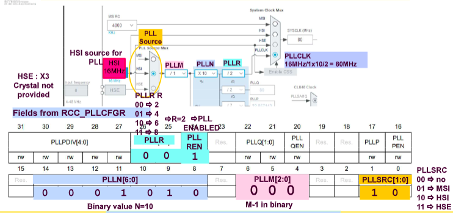

# EXPLICATIONS DES CORRECTIONS DE MICRO-PROCESSEUR
$$test$$
## Micro-processeur 2023

[Sujet](./CS/micro_processeur/sujet_2023.pdf) et [Correction](./CS/micro_processeur/correction_2023.pdf)

### Q1 :

La question concerne les instructions **du micro processeur**, on va donc chercher la clock **du micro processeur** pour connaitre le temps d'un
cycle. 

En utilsant le graphique fournit, on trouve toutes les frequences de clock des différent périphérique dont celle du processeur : 

On trouve donc une fréquence de 100 MHz pour le processeur. 

Ainsi : $t_{cycle} = \frac{1}{f_{clock}} = \frac{1}{100 \times 10^6} = 10 ns= 10^{⁻8} s = \frac{1}{100}* 10 ^{-6} s$ 

OR, on nous demande le temps de 100 cycles, donc, pour connaitre le temps d'execution, on multiplie le temps d'un cycle par le nombre de cycles :

$t_{execution} = 100 * t_{cycle} = 100*\frac{1}{100} * 10 ^{-6} s$

Donc : $t_{execution} = 10^{-6} s = 1 \mu s$

### Q2 :

Pour la question 2, on doit se référer au cours pour retrouver l'addresse d'ADC, puis lui ajouter l'offset. Pour ça, on se refère à la table fournit dans le cours : 

[page 21 du cours 1](/cours/mineur/cours_micro_p_1.pdf#page=21)

!!! ATTENTION, l'examen n'est pas sur la même carte que notre cours, donc le résultat ne sera pas le même que la correction, mais le raisonnement est le même !!! 

### Q3 : 

A partir de la documentation donné au début de l'énoncé, on retrouve : le bit permettant d'activer ou desactiver la conversion (1) puis la vleur permettant à ce dernier de se mettre en mode conversion (2).

ici, le bit 0

### Q4 :

Ici, il faut comprendre 3 syntaxes différentes : 

1. L'opérateur `->`
2. La syntaxte `& = ` et `| = `
3. La syntaxe `<<`

1. L'opérateur `->` permet d'accéder à un élément d'une structure pointée. Ici, on accède à l'élément `CR2` de la structure pointée par `ADC1` (qui est un pointeur sur une structure). On accède donc à `ADC1->CR2` qui est équivalent à `(*ADC1).CR2`
2. Les syntaxes `& ` et `|` sont des opérations de bits. `&` est un `ET` binaire et `|` est un `OU` binaire. `x *= y`, ou `*` est une opération, est équivalent à `x = x * y`. Donc `&=` est équivalent à `x = x & y` et `|=` est équivalent à `x = x | y`.
3. L'opération `<<` est un décalage à gauche. `x << y` décale `x` de `y` bits vers la gauche. exemple : `0b0001 << 1 = 0b0010`

Avec toutes ces informations, et la consigne, on commprends qu'on cherche à utiliser un mask et un OU logique, donc on peut exclure toutes les commandes qui ne sont pas des OU logiques `&` ou aucun maskage.

Enesuite, on va chercher quel bit on doit modifier en se reférant à la documentation du début du sujet :

On cherche donc un mask de de valeur `0x1 0000 0000`, soit 256 en décimal. 

La reponse F correspond exactement à ce qu'on cherche (`ADC1->CR2 |= 256`), mais ce n'est pas la seule. En effet, le decalage à gauche de 8 bits est aussi une solution (`ADC1->CR2 |= 1 << 8`) car en decallant un 1 de 8 bit vers la gauche, on passe de `0x0 0000 0001` à `0x1 0000 0000`, ce qui donne bien le même mask.

### Q5 :

Pour trouver cette réponse, il faut encore se référer au cours afin de trouver à quel APB, l'USART demandé est connecté :

[page 15 du cours 1](/cours/mineur/cours_micro_p_1.pdf#page=15)

On trouve ici que l'USART1 est connecté à l'APB2. Une fois qu'on le sait, il suffit de regarder la clock de l'APB2 pour trouver la réponse :

### Q6 :

Même logique

### Q7 :

Même logique mais il faut maintenant connaitre l'appartenance d'un timer à un APB. Pour ça, on se réfère encore à [page 15 du cours 1](/cours/mineur/cours_micro_p_1.pdf#page=21) :

On trouve que le timer 3 est connecté à l'APB2. On cherche donc la clock des timers de l'APB1 :

### Q8 :

Même logique

### Q9, Q10, Q11 :

Pour répondre à cette question, il faut se référer à la documentation fourni dans le cours concernant la configuration de la PLL et l'organisation de ses registres : 

[page 13 du cours 2](/cours/mineur/cours_micro_p_2.pdf#page=13) et [page 14 du cours 2](/cours/mineur/cours_micro_p_2.pdf#page=14)

avec ça on trouve :

- les valeurs à modifier pour la PLLSRC 
- les valeurs à modifier pour le PLLM (M dans le sujet)
- les valeurs à modifier pour le PLLN (N dans le sujet)
- les valeurs à modifier pour le PLLR (P dans le sujet)

et on converti ces derniers en binaire en suivant les consignes du sujet pour arriver aux réponses !

### Q12 :

Il faut attentivement analyser ce que le sujet entend par "afficher le bon temps", pour pouvoir correctement commencer. 

1. gn compte chaque fois que le timer envoi un interrupt
2. Sa valeur est divisée par 10 mais reste sous forme de float (avec des décimales), donc
3. on affiche ensuite " sec"

On chercher donc à afficher les 10èmes de secondes. Une fois cet aspect clarifié, on peut commencer à chercher la réponse : 

On cherche un timer qui envoie un interrupt toutes les 100ms, ce qui donne une frequence de timer de 10Hz. On la note $f_{timer}$. 

Ensuite, on donne un PSC (prescaler) de 10 000 - 1 par rpport à la fréquence de clock du timer, noté $f_{clock} = 25 MHz$ (ici TIMER 2 est connecté à l'APB1, donc on se réfère à la clock de l'APB1 du timer = 25 MHz). Donc, le compter du timer augmente de 1 à une fréquence de comptage $f_{comptage}=\frac{f_{clock}}{PSC+1}$ d'après [la page 19 du cours 2](/cours/mineur/cours_micro_p_2.pdf#page=19). 

La frequence de timer est donc la fréquence à laquelle le compteur du timer atteint sa valeur maximale, définie par ARR+1 (toujours d'après [la page 19 du cours 2](/cours/mineur/cours_micro_p_2.pdf#page=19)). Ainsi, on a $f_{timer} = \frac{f_{comptage}}{ARR+1}$.

Finalement, on arrive à la relation suivante : $f_{timer} = \frac{f_{clock}}{(PSC+1)*(ARR+1)}$, ce qui donne une l'égalité suivante : $\frac{f_{clock}}{f_{timer}} = (PSC+1)*(ARR+1)$ , puis : $ARR = \frac{f_{clock}}{f_{timer}(PSC +1)} - 1$.

En replaçant par les valeurs de l'énoncé, on trouve que $ARR = 249$.

iii 
TIPS : retenez ces 3 egalités pour tout retrouver :  
$f_{comptage}=\frac{f_{clock}}{PSC+1}$  
$f_{timer} = \frac{f_{comptage}}{ARR+1}$  
$\frac{f_{clock}}{f_{timer}} = (PSC+1)*(ARR+1)$  
iii

### Q13 :

J'ai rien compris : courage :D